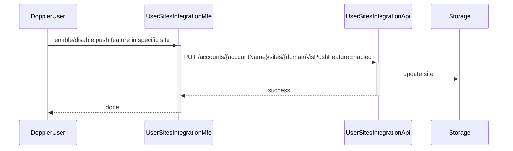

# doppler-user-sites-integration

# Enable/disable push feature in specific domain

```mermaid
sequenceDiagram
  participant DopplerUser
  participant UserSitesIntegrationMfe
  participant UserSitesIntegrationApi
  participant Storage
DopplerUser->>+UserSitesIntegrationMfe: enable/disable push feature in specific site
UserSitesIntegrationMfe->>+UserSitesIntegrationApi: PUT /accounts/{accountName}/sites/{domain}/isPushFeatureEnabled
UserSitesIntegrationApi->>+Storage: update site
UserSitesIntegrationApi-->>-UserSitesIntegrationMfe: success
UserSitesIntegrationMfe-->>-DopplerUser: done!
```
