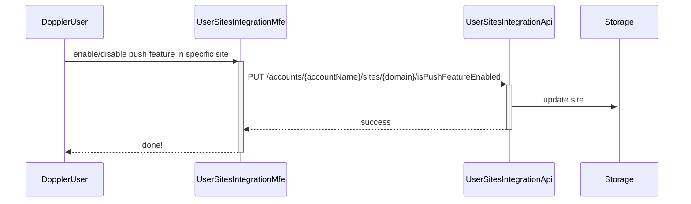
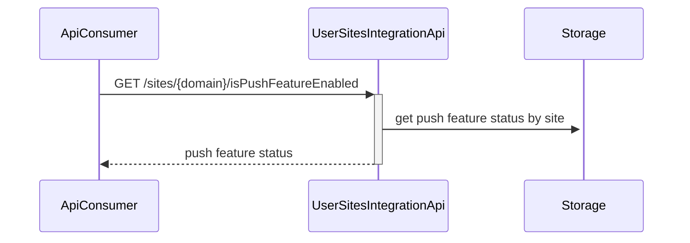

# doppler-user-sites-integration

# Enable/disable push feature in specific domain

```mermaid
sequenceDiagram
  participant DopplerUser
  participant UserSitesIntegrationMfe
  participant UserSitesIntegrationApi
  participant Storage
DopplerUser->>+UserSitesIntegrationMfe: enable/disable push feature in specific site
UserSitesIntegrationMfe->>+UserSitesIntegrationApi: PUT /accounts/{accountName}/sites/{domain}/isPushFeatureEnabled
UserSitesIntegrationApi->>+Storage: update site
UserSitesIntegrationApi-->>-UserSitesIntegrationMfe: success
UserSitesIntegrationMfe-->>-DopplerUser: done!
```

# Get push feature status by domain name

```mermaid
sequenceDiagram
  participant ApiConsumer
  participant UserSitesIntegrationApi
  participant Storage
ApiConsumer->>+UserSitesIntegrationApi: GET /sites/{domain}/isPushFeatureEnabled
UserSitesIntegrationApi->>+Storage: get push feature status by site
UserSitesIntegrationApi-->>-ApiConsumer: push feature status
```
